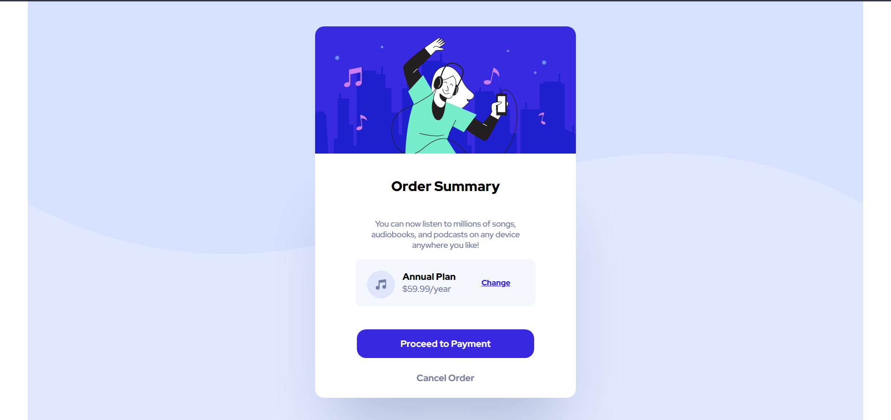

# Frontend Mentor - Order summary card solution

This is a solution to the [Order summary card challenge on Frontend Mentor](https://www.frontendmentor.io/challenges/order-summary-component-QlPmajDUj). Frontend Mentor challenges help you improve your coding skills by building realistic projects.

## Table of contents

- [Overview](#overview)
  - [The challenge](#the-challenge)
  - [Screenshot](#screenshot)
- [My process](#my-process)
  - [Built with](#built-with)
  - [What I learned](#what-i-learned)
  - [Continued development](#continued-development)
- [Author](#author)

## Overview

### The challenge

Users should be able to:

- See hover states for interactive elements

### Screenshot



## My process

### Built with

- Semantic HTML5 markup
- CSS custom properties
- Flexbox
- Sass

### What I learned

While working on this project I learnt the basics of developing a component with responsive CSS and HTML with the help of Sass.

To see how you can add code snippets, see below:

```html
<h1>Some HTML code I'm proud of</h1>
```

```css
.proud-of-this-css {
  color: papayawhip;
}
```

### Continued development

One thing I am still not comfortable is with Mobile-First Development. A need of the hour but I'd like to take some time to be familiar with that way doing things so I can perform better in the future.

## Author

- GitHub - [thesacredcoder](https://www.github.com/thesacredecoder/frontend-mentor-order-summary)
- Frontend Mentor - [@thesacredcoder](https://www.frontendmentor.io/profile/thesacredcoder)
